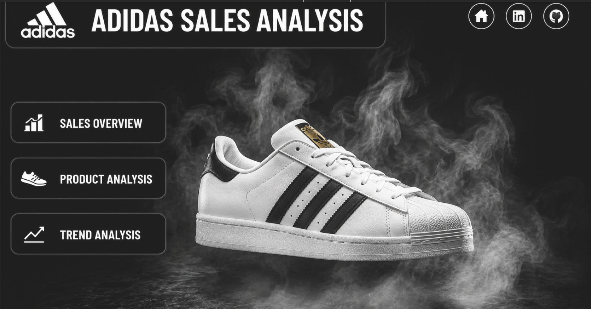
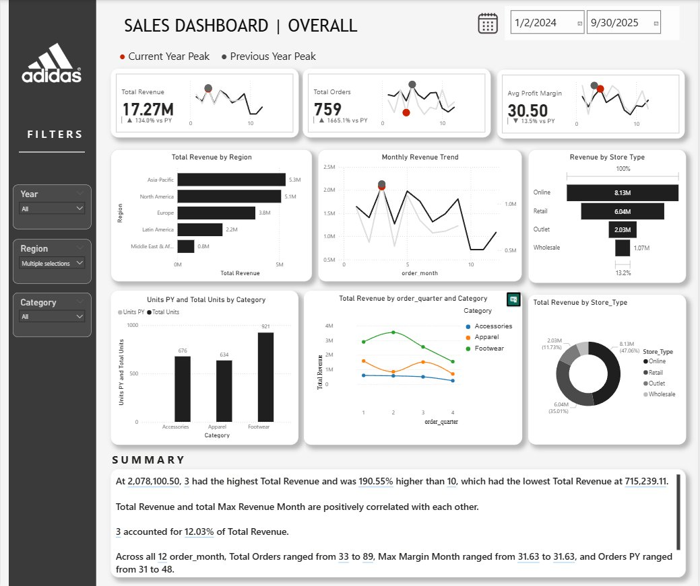
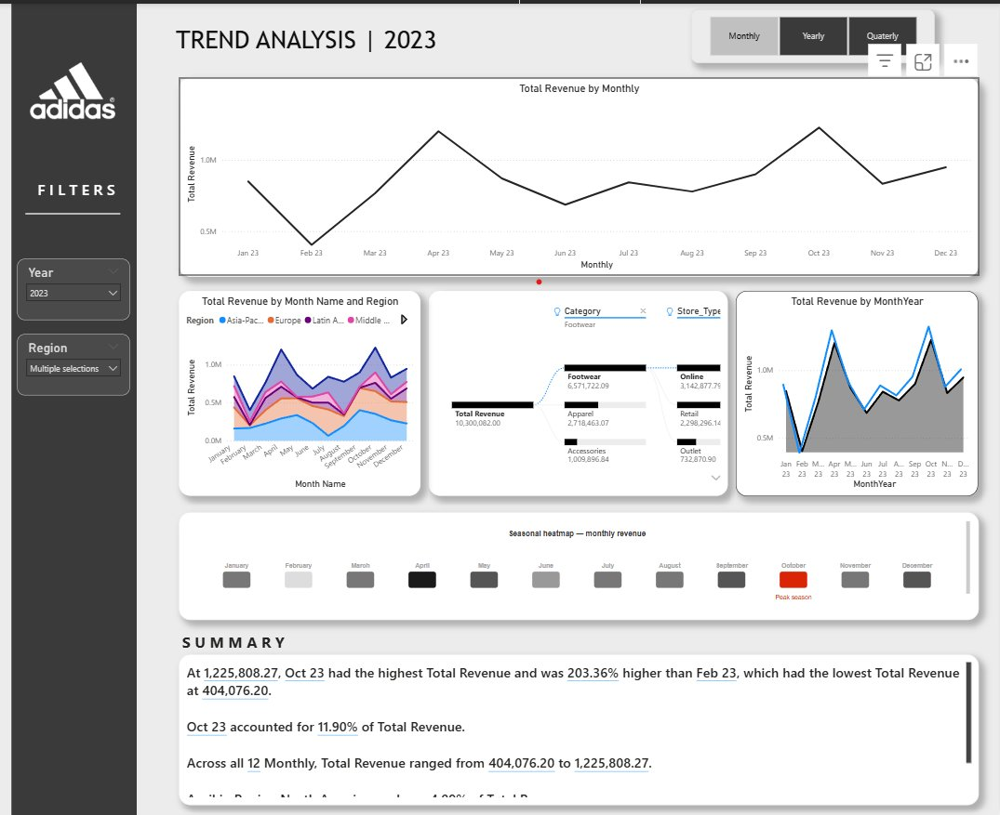
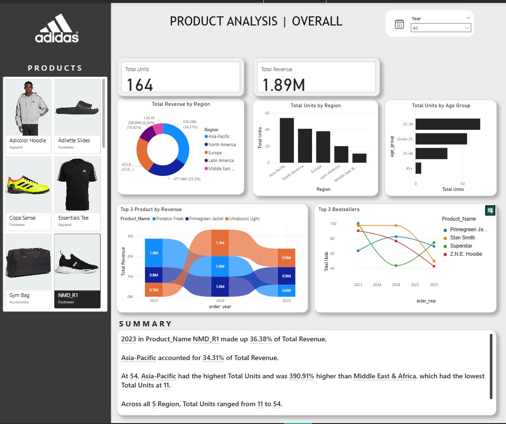

<div align="center">


# 👟 Adidas Global Sales — Power BI Dashboard

**An interactive, executive-ready 4-page Power BI dashboard built on the Adidas Global Sales dataset.**


| 📦 1,200 Orders | 🏷️ 20 Products | 🌍 5 Regions | 🏪 4 Store Types | 💳 8 Payment Methods |
|:-:|:-:|:-:|:-:|:-:|

</div>

---

## 📌 Overview

This project delivers a comprehensive **Power BI Sales Intelligence Dashboard** for Adidas, transforming 1,200 transaction records (Jan 2024 – Sep 2025) into an interactive, stakeholder-ready analytics solution.

The dashboard spans **4 pages** — Landing, Sales Overview, Trend Analysis, and Product Analysis — and is powered by a robust **Star Schema data model** with optimized DAX measures, enabling fast cross-filter slicing and deep business insights across products, regions, channels, and time.

---

## ❗ Problem Statement

| # | Problem | Impact |
|---|---------|--------|
| P1 | **No unified view** — sales data scattered across systems | Executives lack a single source of truth |
| P2 | **No time-series visibility** — monthly/quarterly trends unmeasured | Poor forecasting & campaign planning |
| P3 | **Product blind spots** — no consolidated SKU scorecard | Can't compare revenue, margin, or units across 20 products |
| P4 | **Regional gaps** — 5 global zones not visually compared | Geographic opportunities remain hidden |
| P5 | **Discount impact unknown** — no profitability analysis by tier | Potentially ineffective promotional strategies |

---

## 🎯 Objectives

**Primary Goal:** Build a 4-page interactive Power BI dashboard using the Adidas Sales dataset as the single source of truth.

**Analytical Goals:**
- Track **Revenue, Profit, Units Sold & AOV** across all pages
- Enable **time-series analysis** at day / month / quarter / year granularity
- Compare **product performance** across categories, SKUs, and store types
- Map **regional sales distribution** across 5 global zones
- Analyse **discount tier impact** on revenue and profit margins

**Technical Goals:**
- Implement a **Star Schema** with 1 fact table + 5 dimension tables
- Create **3 gold-layer aggregation tables** for fast KPI rendering
- Write optimized **DAX measures** for margins, YoY growth & rolling averages

---

## 🗂️ Dataset Overview

> **File:** `adidas_dataset.csv` | **Rows:** 1,200 | **Columns:** 16 | **Nulls:** 0

| Column | Type | Description |
|--------|------|-------------|
| `Order_ID` | int | Unique transaction identifier |
| `Order_Date` | date | Jan 2024 – Sep 2025 |
| `SKU` | string | Stock Keeping Unit code |
| `Product_Name` | string | 20 unique products |
| `Category` | string | Footwear / Apparel / Accessories |
| `Region` | string | 5 global regions |
| `Store_Type` | string | Online / Retail / Outlet / Wholesale |
| `Units_Sold` | int | 1–7 units per order |
| `Unit_Price` | float | $12.19 – $1,526 |
| `Discount` | int | 0 / 5 / 10 / 20 / 40% |
| `Revenue` | float | Avg $239.48 per order |
| `Profit` | float | Avg $70.89 per order |
| `Customer_Age` | int | Numeric age range |
| `Gender` | string | Male / Female / Other |
| `Payment_Method` | string | 8 methods |
| `image_url` | string | CDN URLs for 20 product images |

---

## 🛠️ Tech Stack

| Tool | Purpose |
|------|---------|
| **Databricks** | Cloud-based ETL & data engineering platform |
| **Apache Spark** | Distributed data processing & transformation |
| **Delta Lake** | ACID-compliant data storage (Bronze → Silver → Gold) |
| **Microsoft Power BI Desktop** | Dashboard development & publishing |
| **DAX** | KPI measures, time-intelligence & aggregations |
| **Power BI Service** | Stakeholder sharing & deployment |
| **Star Schema Design** | Optimized relational data model |

---

## 🔄 Data Pipeline / Workflow

```
Raw CSV (1,200 × 16)
        │
        ▼
┌──────────────────────────────────────────┐
│         DATABRICKS  (ETL Layer)          │
│                                          │
│  🥉 Bronze Layer  →  Ingested raw data   │
│  🥈 Silver Layer  →  Cleaned & typed     │
│  🥇 Gold Layer    →  Aggregated tables   │
│                                          │
│  Engine : Apache Spark (PySpark)         │
│  Storage: Delta Lake (ACID transactions) │
└───────────────────┬──────────────────────┘
                    │
                    ▼
┌──────────────────────────────────────────────────────┐
│              Power BI  —  Star Schema Model          │
│                                                      │
│   dim_product   dim_region   dim_store_type          │
│        │             │             │                 │
│        └─────────────┴─────────────┘                 │
│                      │                               │
│               ┌──────▼──────┐                        │
│               │  fact_sales │ ◄── dim_customer       │
│               └──────┬──────┘ ◄── dim_date           │
└──────────────────────┼───────────────────────────────┘
                       │
         ┌─────────────┼─────────────┐
         ▼             ▼             ▼
  gold_revenue    gold_product   gold_monthly
  _by_region      _performance    _trend
                       │
                       ▼
            ┌──────────────────┐
            │  DAX Measures    │
            │  (KPIs, YoY,     │
            │  Rolling Avg)    │
            └────────┬─────────┘
                     │
                     ▼
          4-Page Power BI Dashboard
```

**Key DAX Measures:**
```dax
Total Revenue      = SUM(fact_sales[Revenue_INR])
Total Profit       = SUM(fact_sales[Profit_INR])
Profit Margin %    = DIVIDE([Total Profit], [Total Revenue], 0)
Avg Order Value    = DIVIDE([Total Revenue], COUNTROWS(fact_sales))
YoY Revenue Growth = [Total Revenue] / CALCULATE([Total Revenue], SAMEPERIODLASTYEAR(dim_date[Order_Date])) - 1
Rolling 3M Revenue = CALCULATE([Total Revenue], DATESINPERIOD(dim_date[Order_Date], LASTDATE(dim_date[Order_Date]), -3, MONTH))
```

---

## 📊 Dashboard Features

### 🏠 Page 1 — Landing Page
- Dramatic **dark-mode Adidas brand header** with product hero image
- **3 navigation buttons** — Sales Overview, Product Analysis, Trend Analysis — with custom icons
- Top-right icon bar with Home, LinkedIn, and GitHub quick-links
- Clean, minimal entry point designed for executive first impressions

### 📈 Page 2 — Sales Dashboard | Overall
- **3 KPI cards** with sparklines — Total Revenue (17.27M), Total Orders (759), Avg Profit Margin (30.50%) — each showing YoY % change vs previous year
- **Horizontal bar chart** — Total Revenue by Region (Asia-Pacific leads at 5.3M)
- **Monthly Revenue Trend line** — current vs. previous year overlay with peak markers
- **Revenue by Store Type bar chart** — Online (8.13M) → Retail (6.04M) → Outlet (2.03M) → Wholesale (1.07M)
- **Grouped bar chart** — Units sold PY vs. current by Category (Footwear, Apparel, Accessories)
- **Line chart** — Total Revenue by quarter and Category (Footwear / Apparel / Accessories trends)
- **Donut chart** — Revenue share by Store Type
- **AI Summary panel** — auto-generated narrative insights at the bottom
- Slicers: Year, Region, Category

### 📉 Page 3 — Trend Analysis
- **Toggle buttons** — switch between Monthly / Yearly / Quarterly views instantly
- **Full-width line chart** — Total Revenue by Month with clear seasonal peaks
- **Multi-region area chart** — Revenue by Month and Region (Asia-Pacific, Europe, Latin America, Middle East stacked)
- **Sankey / flow chart** — Revenue breakdown from Category → Store Type
- **Line chart** — Total Revenue by MonthYear (current vs. prior year in blue/grey overlay)
- **Seasonal heatmap** — monthly revenue intensity across the year with peak month highlighted in red (October)
- **AI Summary panel** — auto-generated key trend callouts
- Slicers: Year, Region

### 🛍️ Page 4 — Product Analysis | Overall
- **Scrollable product image sidebar** — real product photos (Adicolor Hoodie, Adilette Slides, Copa Sense, Essentials Tee, Gym Bag, NMD_R1, etc.) with name and category label
- **2 KPI cards** — Total Units (164) and Total Revenue (1.89M)
- **Donut chart** — Total Revenue by Region with % breakdown
- **Bar chart** — Total Units by Region
- **Horizontal bar chart** — Total Units by Age Group (25–34 leads)
- **Stacked area / stream chart** — Top 3 Products by Revenue over time (Predator Freak, Primegreen Jacket, Ultraboost Light)
- **Multi-line chart** — Top 3 Bestsellers by units (Primegreen Jacket, Stan Smith, Superstar, Z.N.E. Hoodie)
- **AI Summary panel** — product-level narrative insights (NMD_R1 revenue share, Asia-Pacific dominance, age group spread)
- Slicer: Year

---

## 📐 Dashboard Layouts

### 🏠 Landing Page


*Dark-mode hero page with branded navigation buttons linking to all three analytical pages.*

---

### 📊 Sales Dashboard | Overall


*KPI cards with YoY sparklines, regional revenue bar chart, monthly trend overlay, store-type breakdown, category units comparison, and AI-generated summary panel.*

---

### 📉 Trend Analysis


*Monthly / Yearly / Quarterly toggle views, multi-region stacked area chart, category-to-store-type flow, MonthYear overlay line chart, and seasonal revenue heatmap with October peak highlighted.*

---

### 🛍️ Product Analysis | Overall


*Scrollable product image sidebar, regional revenue donut, age-group unit distribution, top-3 revenue stream chart, bestseller trend lines, and AI-generated product insights.*

---

## 📌 Key Insights

| KPI | Value |
|-----|-------|
| 💰 Total Revenue | **17.27M** |
| 📦 Total Orders | **759** |
| 📊 Avg Profit Margin | **30.50%** |
| 🌏 Top Region | **Asia-Pacific (5.3M)** |
| 🏪 Top Store Type | **Online (8.13M — 47%)** |

- **Asia-Pacific** leads all regions at 5.3M revenue, with North America close behind at 5.1M
- **Online channel** dominates with 47% revenue share (8.13M), nearly double Retail (6.04M)
- **Footwear** is the top-performing category across all regions and quarters
- **October** is the peak revenue month — clearly visible in the seasonal heatmap
- **NMD_R1** accounted for 36.38% of Total Revenue in 2023; **Asia-Pacific** drove 34.31% of product revenue
- The **25–34 age group** is the highest-volume buyer segment across all products
- Revenue and total Max Revenue Month are **positively correlated**, confirming seasonal campaign effectiveness

---

## 🚀 Future Enhancements

- [ ] **Real-time data refresh** via Power BI Gateway integration
- [ ] **AI-powered Q&A** visual using Power BI's natural language engine
- [ ] **Predictive forecasting** with Azure ML integration
- [ ] **Customer segmentation** using RFM (Recency, Frequency, Monetary) analysis
- [ ] **Mobile-optimized** layout for Power BI Mobile app
- [ ] **Row-level security (RLS)** for region-specific stakeholder access
- [ ] Expand dataset to **full-year 2025** once data is available

---

## ✅ Conclusion

This Power BI dashboard transforms raw Adidas sales data into a **unified, interactive intelligence platform** — giving stakeholders instant visibility into revenue performance, product profitability, regional trends, and discount effectiveness. The underlying Star Schema and optimized DAX layer ensure the solution is **scalable, reusable, and production-ready** for future dataset expansion.

---

## 📁 Project Structure

```
adidas-powerbi-dashboard/
│
├── 📓 notebooks/                    # Databricks ETL notebooks
│   ├── 01_bronze_ingestion.py       # Raw CSV → Delta Bronze
│   ├── 02_silver_transform.py       # Cleaning & typing → Delta Silver
│   └── 03_gold_aggregation.py       # Aggregated tables → Delta Gold
├── 📊 adidas_dashboard.pbix         # Power BI report file
├── 📄 adidas_dataset.csv            # Source dataset (1,200 × 16)
├── 📋 Adidas_PowerBI_Proposal.pdf   # Full project proposal
├── 📸 landing_page.png
├── 📸 sales_overview.png
├── 📸 trend_analysis.png
├── 📸 product_analysis.png
└── 📖 README.md
```

---

## 🗓️ Project Timeline

| Week | Phase | Deliverable |
|------|-------|-------------|
| Week 1 | ETL & Data Engineering | Raw CSV ingested into Databricks; Bronze → Silver → Gold Delta Lake layers built using Apache Spark; cleaned & aggregated datasets ready for BI consumption |
| Week 2 | Power BI Development | Star schema modelled in Power BI; all DAX measures written; all 4 dashboard pages designed, populated, and published to Power BI Service |
| Week 3 | QA & Review | Stakeholder review, bug fixes, performance optimisation |
| Week 4 | Publish & Hand-off | Published to Power BI Service; documentation and README delivered |

---

<div align="center">

**Prepared by:** Aman Faras &nbsp;|&nbsp; **Version:** v1.0 &nbsp;|&nbsp; **Year:** 2025

*Built with ❤️ using Microsoft Power BI Desktop*

</div>
